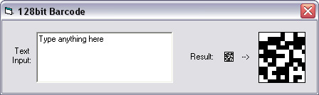

<div align="center">

## Barcode Generator Using MD5


</div>

### Description

This is a small example of how to create an MD5 hash and turn it into a barcode which could be used also as a password verification system.

Example: you could take the generated barcode, save it to a file, then when a user types in their password, the program would verify it by comparing the saved barcode to the one generated by the user logging in.

I appologize ahead of time for not commenting the code. It was an idea that just popped into my head, so I threw together in a few minutes. On a side note, the MD5 class I included is not my work. It was one I found on the internet and had saved in my archive, so I don't know who or where I got it from.
 
### More Info
 


<span>             |<span>
---                |---
**Submitted On**   |2006-06-03 14:54:28
**By**             |[Chris Dwinell](https://github.com/Planet-Source-Code/PSCIndex/blob/master/ByAuthor/chris-dwinell.md)
**Level**          |Intermediate
**User Rating**    |4.5 (18 globes from 4 users)
**Compatibility**  |VB 6\.0
**Category**       |[Encryption](https://github.com/Planet-Source-Code/PSCIndex/blob/master/ByCategory/encryption__1-48.md)
**World**          |[Visual Basic](https://github.com/Planet-Source-Code/PSCIndex/blob/master/ByWorld/visual-basic.md)
**Archive File**   |[Barcode\_Ge199849632006\.zip](https://github.com/Planet-Source-Code/chris-dwinell-barcode-generator-using-md5__1-65557/archive/master.zip)

### API Declarations

```
Private Type RECT
  Left  As Long
  Top  As Long
  Right As Long
  Bottom As Long
End Type
Private Declare Function CreateSolidBrush Lib "gdi32.dll" (ByVal crColor As Long) As Long
Private Declare Function DeleteObject Lib "gdi32.dll" (ByVal hObject As Long) As Long
Private Declare Function FillRect Lib "user32.dll" (ByVal hDC As Long, lpRect As RECT, ByVal hBrush As Long) As Long
Private Declare Function SetPixel Lib "gdi32.dll" Alias "SetPixelV" (ByVal hDC As Long, ByVal x As Long, ByVal y As Long, ByVal crColor As Long) As Long
```


